# Introdução

Informações básicas do projeto.

* **Projeto:** LocalizeMe
* **Repositório GitHub:** https://github.com/ICEI-PUC-Minas-CC-TI/ti1-2025-1-t2-manha-localizeme.git
* **Membros da equipe:**

  * Ane Madjarian Viana (https://github.com/anemadjarian)
  * Gabriel Costa Lima (https://github.com/gcl32)
  * Guilherme Almeida Zuim (https://github.com/zoiacode)
  * Mateus Henrique Saturnino Gonçalves (https://github.com/mateusatus)
  * Nathan Barros de Carvalho (https://github.com/nthapt)

A documentação do projeto é estruturada da seguinte forma:

1. Introdução
2. Contexto
3. Product Discovery
4. Product Design
5. Metodologia
6. Solução
7. Referências Bibliográficas

✅ [Documentação de Design Thinking (MIRO)](files/processo-dt.pdf)

# Contexto

Detalhes sobre o espaço de problema, os objetivos do projeto, sua justificativa e público-alvo.

## Problema

Belo Horizonte é amplamente reconhecida como a "capital dos bares" no Brasil, oferecendo uma variedade impressionante de estabelecimentos para todos os gostos e preferências. No entanto, essa grande oferta pode tornar a busca pelo bar ideal um desafio, especialmente para quem deseja um local que atenda a critérios específicos.

## Objetivos

O projeto LocalizeMe será um software voltado para oferecer recomendações personalizadas de bares na cidade de Belo Horizonte. Além disso, a plataforma funcionará como um mecanismo de busca, permitindo que os usuários obtenham informações detalhadas sobre cada estabelecimento. O site reunirá dados essenciais, como endereço, cardápio, fotos do local, avaliações e integração com o Instagram para exibição de publicações recentes. Para garantir uma experiência intuitiva, a estrutura do site será projetada de forma clara e acessível, facilitando tanto a administração das páginas pelos proprietários dos estabelecimentos quanto a busca dos clientes pelo bar ideal.

## Justificativa

A motivação para desenvolver o LocalizeMe está diretamente ligada à importância da socialização e da experiência de lazer, tanto para turistas quanto para moradores da cidade. 
Para os turistas, essa dificuldade é ainda maior, pois muitos chegam à cidade sem conhecer bem os bairros, as opções disponíveis e os estilos de bares que mais combinam com suas preferências. 
Já para os moradores da cidade, sair para socializar não é apenas um lazer, mas também uma necessidade para o bem-estar mental. Ter momentos de descontração em um ambiente agradável ajuda a aliviar o estresse, fortalecer vínculos sociais e até melhorar a qualidade de vida. No entanto, muitas pessoas acabam frequentando sempre os mesmos bares por não saberem onde encontrar novas opções alinhadas ao seu gosto.

## Público-Alvo

Existem três perfis para o público-alvo:
1. Donos de estabelecimentos, que administrarão as páginas de seus bares: possuem pouco conhecimento sobre tecnologia, exige um software fácil e prático para entendimento;
2. Pessoas locais, querem conhecer estabelecimentos novos;
3. Turistas: pouco ou nenhum conhecimento sobre a cidade de Belo Horizonte.

# Product Discovery

Vamos mergulhar no universo dos usuários para descobrir:

- O que realmente importa para quem busca bares em BH
- Os desafios enfrentados pelos donos de estabelecimentos
- Como criar uma solução eficaz que resolva esses problemas na prática

---

## Etapa de Entendimento

Na **Etapa de Entendimento**, utilizaremos a metodologia **Design Thinking** para compreender profundamente o problema. Durante esse processo, vamos criar e refinar as ferramentas abaixo:

### 1. Matriz CSD
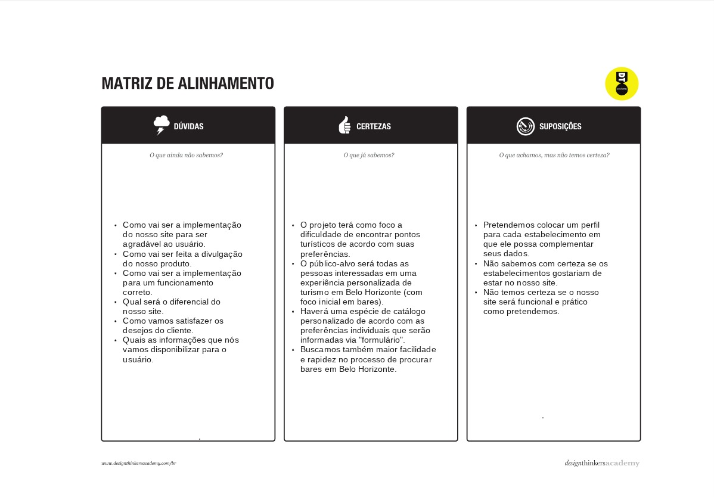

### 2. Mapa de Stakeholders
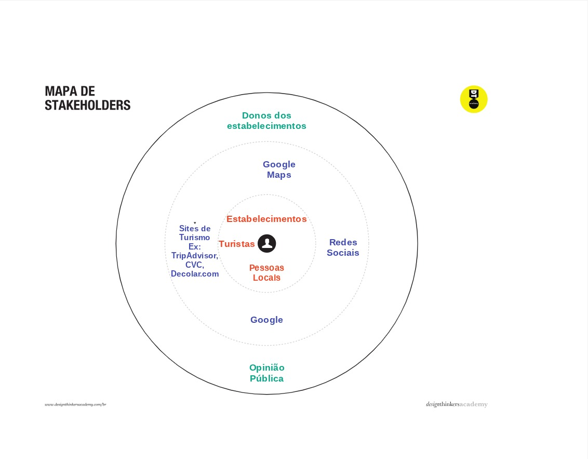

#### Detalhes Importantes:
- **Entrevistados**:  (4 pessoas, 3 donos de bares)
- **Ferramenta**: [Notes]
- **Período de coleta**: 17/Abril/2025

---

## Entrevistas Qualitativas

### Clientes

**Helena** (Estudante de Psicologia)

- **Qual a sua maior dificuldade em encontrar bares da sua preferência?**
  - *"No início, quando cheguei a BH, não tive problemas. Porém, depois de um tempo, comecei a procurar lugares diferentes que não eram recomendados por pessoas próximas. Encontrei dificuldades em achar informações corretas, como fotos do ambiente, cardápio atualizado, horários de funcionamento e avaliações de outros clientes."*

- **Você sente falta de algo ao utilizar essa ferramenta?**
  - *"Sim. Falta um único lugar que centralize tudo o que eu procuro. Eu me irrito ao ter que usar vários aplicativos para encontrar informações sobre um estabelecimento."*

- **Qual ferramenta você usa na hora de buscar um bar?**
  - *"Usava TikTok para vídeos de recomendações, Instagram para ver fotos e o Google Maps para avaliações, endereço e criar listas de lugares."*

---

**Gabriel** (Estudante de Ciência da Computação)

- **Qual a sua maior dificuldade em encontrar bares da sua preferência?**
  - *"A principal dificuldade é não encontrar lugares divididos por categorias, onde todas as informações sejam claras, para não perder tempo procurando."*

- **Você sente falta de algo ao utilizar essa ferramenta?**
  - *"Sim, sinto falta de integração entre os aplicativos. Não há uma ferramenta que reúna todas as informações de forma clara e concisa."*

- **Qual ferramenta você usa na hora de buscar um bar?**
  - *"Recomendações de amigos, Ifood e Google Maps."*

---

**João e Roberta** (Estudantes de Ciência da Computação)

- **Qual a sua maior dificuldade em encontrar bares da sua preferência?**
  - *"Usamos Google Maps, Instagram e recomendações de pessoas."*

- **Você sente falta de algo ao utilizar essa ferramenta?**
  - *"Fotos falsas que não representam fielmente o que é mostrado nas redes sociais."*

- **Qual ferramenta você usa na hora de buscar um bar?**
  - *"Informações atualizadas sobre o local e localização."*

---

### Donos de Bares

**Denilson** (Dono do "Coreu Bar")

- **Qual a sua maior dificuldade em encontrar clientes?**
  - *"Atualmente, não enfrento dificuldades em encontrar clientes."*

- **Você sente falta de algo na plataforma que usa?**
  - *"Sinto falta de uma coordenação mais eficaz das redes sociais, devido ao uso de uma empresa terceirizada."*

- **Você utiliza alguma plataforma para encontrar novos clientes?**
  - *"Sim, uso Instagram."*

---

**Everton** (Dono do "Tacos")

- **Qual a sua maior dificuldade em encontrar clientes?**
  - *"Nunca tive dificuldades para encontrar clientes."*

- **Você sente falta de alguma ferramenta?**
  - *"Falta receber feedbacks e críticas dos clientes."*

- **Você utiliza alguma plataforma para encontrar novos clientes?**
  - *"Sim, uso Instagram e Facebook, com suporte de uma empresa terceirizada."*

---

**Hugo** (Dono do "A Granel")

- **Qual a sua maior dificuldade em encontrar clientes?**
  - *"Não tive dificuldades."*

- **Você sente falta de alguma ferramenta?**
  - *"Sinto falta de feedbacks mais diretos."*

- **Você utiliza alguma plataforma para encontrar novos clientes?**
  - *"Uso Instagram e apoio de uma empresa terceirizada."*

---

## Highlights da Pesquisa

- **Principais queixas**:
  - Falta de informações sobre preços e condições do local
  - Lugares lotados ou com atendimento ruim
  - Falta de feedback dos clientes

---
## Etapa de Definição

### Dores Principais

---

#### **Clientes**

1. **Informações desencontradas/dispersas**  
   A falta de centralização e organização das informações disponíveis causa frustração na hora da busca.

2. **Falta de transparência**  
   Fotos imprecisas ou desatualizadas e preços escondidos dificultam a decisão dos consumidores.

3. **Dificuldade em filtrar por preferências**  
   Os clientes não conseguem facilmente filtrar os bares de acordo com suas preferências pessoais (ex: ambiente, preço, tipo de comida).

---

#### **Donos de Bares**

1. **Gestão ineficiente de redes sociais**  
   A falta de uma estratégia bem definida para as redes sociais compromete o alcance e o engajamento.

2. **Pouco feedback qualificado**  
   Há uma escassez de comentários úteis e construtivos que ajudem a melhorar os serviços e a experiência do cliente.

3. **Dificuldade em destacar diferenciais**  
   Não há uma plataforma eficaz que ajude os donos a se diferenciarem no mercado competitivo de bares, perdendo oportunidades de atrair clientes.

---

### Personas

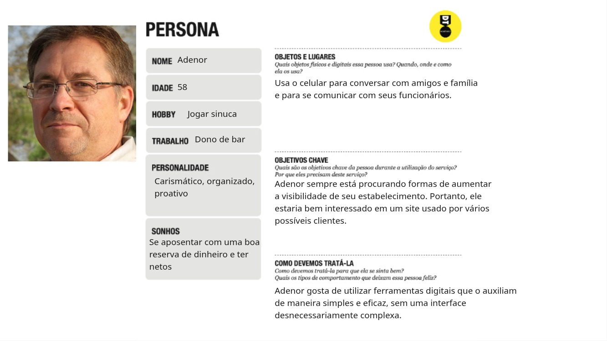
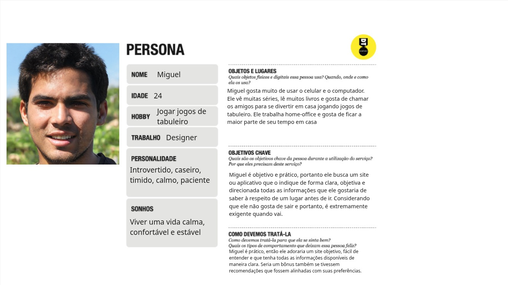
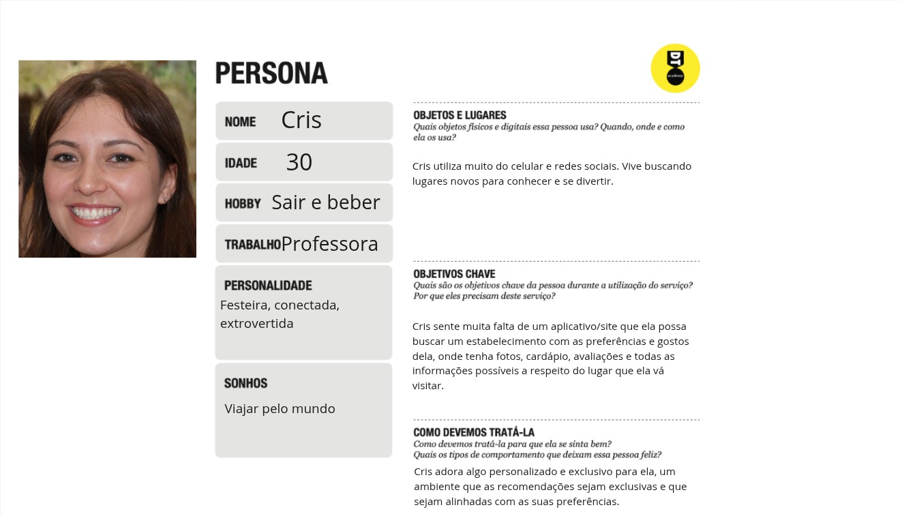

#### 📍 **Perfil Cris**

| **Nome**    | Cris                         |
|-------------|------------------------------|
| **Idade**   | 30 anos                      |
| **Ocupação**| Professora                   |
| **Hobbies** | Sair e beber                 |
| **Personalidade** | Festeira, conectada, extrovertida |
| **Sonhos**  | Viajar pelo mundo            |

#### 📍 **Perfil Miguel**

| **Nome**    | Miguel                       |
|-------------|------------------------------|
| **Idade**   | 24 anos                      |
| **Ocupação**| Designer                     |
| **Hobbies** | Jogos de tabuleiro           |
| **Personalidade** | Introvertido, calmo, paciente |
| **Sonhos**  | Viver uma vida confortável e estável |

#### 📍 **Perfil Adenor**

| **Nome**    | Adenor                       |
|-------------|------------------------------|
| **Idade**   | 58 anos                      |
| **Ocupação**| Dono de bar                  |
| **Hobbies** | Jogar sinuca                 |
| **Personalidade** | Carismático, organizado, proativo |
| **Sonhos**  | Se aposentar com uma boa reserva e ver os netos crescerem |

# Product Design

Nesse momento, vamos transformar os insights e validações obtidos em soluções tangíveis e utilizáveis. Essa fase envolve a definição de uma proposta de valor, detalhando a prioridade de cada ideia e a consequente criação de wireframes, mockups e protótipos de alta fidelidade, que detalham a interface e a experiência do usuário.

## Histórias de Usuários

Com base na análise das personas foram identificadas as seguintes histórias de usuários:

| EU COMO...`PERSONA` | QUERO/PRECISO ...`FUNCIONALIDADE`        | PARA ...`MOTIVO/VALOR`               |
| --------------------- | ------------------------------------------ | -------------------------------------- |
| Estrangeiro   | Saber onde passar a minha noite confortavelmente e comer bem. | Quero conhecer o que aquele local pode me proporcionar.
| Estrangeiro   | Me divertir na cidade em que estiver viajando. | Guardar boas memórias.
| Estrangeiro   | Informações detalhadas sobre a localização de estabelecimentos.  | Encontrar o local que desejo com facilidade.
| Estrangeiro   | Imagens dos estabelecimentos. | Saber onde posso tirar boas fotos para compartilhar com minha família e meus amigos.
| Pessoa Local  | Avaliação e comentários de outros usuários. | Saber como foi a experiência dos outros clientes
| Pessoa Local  | Localização detalhando pontos próximos. | Saber a maneira mais fácil de chegar no local.
| Turista       | informações detalhadas sobre os cardápios e informações do local. |  explorar novos lugares agradáveis e viver experiências boas.
| Estudante Intercambista   | Recomendações e avaliações dos locais. | Garantir uma boa experiência e evitar frustrações ao chegar no local.
| Estabelecimento  | Um aplicativo de fácil manutenção que me conecte com meu público alvo. | Gerar mais clientes e receita para minha empresa.
| Estabelecimento   | Um aplicativo que eu possa deixar todos os dados importantes disponíveis e de fácil acesso.
 | Deixar o meu possível cliente mais confortável de vir ao meu estabelecimento
| Dono do Estabelecimento  |Um site que facilite a minha comunicação com os meus clientes e forneça informações precisas sobre meu estabelecimento. | Para atrair mais clientes e aumentar os lucros da minha empresa.
| Dono do Estabelecimento   | Um site voltado a exibição de todos os dados do meu estabelecimento, como cardápio e horário de funcionamento de forma lúdica e atrativa para meus clientes. |Para atrair clientes de uma maneira descontraída e espontânea.

## Proposta de Valor

## Requisitos

As tabelas que se seguem apresentam os requisitos funcionais e não funcionais que detalham o escopo do projeto.

### Requisitos Funcionais

| ID     | Descrição do Requisito                                   | Prioridade |
| ------ | ---------------------------------------------------------- | ---------- |
| RF-001 | O sistema deve conter um espaço de comentários ao público;| ALTA  |
| RF-002 | Deve conter informações sobre o local, incluindo fotos verídicas; | ALTA  |
| RF-003 | O site será estruturado para um entendimento fácil e rápido; | ALTA  |
| RF-004 | O site terá uma lista para que a pessoa possa verificar onde ela foi e ainda quer ir; | ALTA  |
| RF-005 | O site terá recomendações personalizadas para cada persona e perfil de cliente (a partir de um formulário de preferências que o cliente irá responder); | ALTA  |
| RF-006 | O site terá uma divisão por categorias para ficar mais fácil a localização do estabelecimento desejado (algum tipo de filtro para cada lugar). | ALTA  |

### Requisitos não Funcionais

| ID      | Descrição do Requisito                                                              | Prioridade |
| ------- | ------------------------------------------------------------------------------------- | ---------- |
| RNF-001 | O site precisa ter um sistema de segurança e de login para confidencialidade dos dados;| MÉDIA|
| RNF-002 |O site precisa estar online 24/07;| BAIXA |
| RNF-003 | O site precisa estar linkado com outros meios, como por exemplo o Instagram, para maior agilidade na atualização de informações; | MÉDIA     |
| RNF-004 | O site devera ser publicado em um ambiente acessível publicamente na Internet;| MÉDIA |
| RNF-005 | O site sera desenvolvido primeiramente para Desktop. | MÉDIA |

## Projeto de Interface

Artefatos relacionados com a interface e a interacão do usuário na proposta de solução.

### Wireframes

Estes são os protótipos de telas do sistema.

Home Page

Homepage com botões de categorias, populares, Novidades, Busca, Perfil, salvar, opção de local e Carrossel

### User Flow

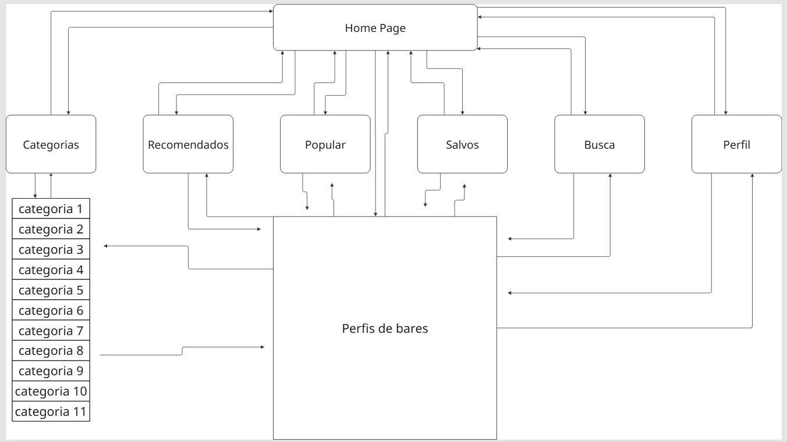

### Protótipo Interativo

https://marvelapp.com/adc9haa

# Metodologia

Detalhes sobre a organização do grupo e o ferramental empregado.

## Ferramentas

Relação de ferramentas empregadas pelo grupo durante o projeto.

| Ambiente                    | Plataforma | Link de acesso                                     |
| --------------------------- | ---------- | -------------------------------------------------- |
| Processo de Design Thinking | Miro       | https://miro.com/app/board/uXjVIVEqQjM=/           |
| Repositório de código       | GitHub     | https://github.com/ICEI-PUC-Minas-CC-TI/ti1-2025-1-t2-manha-localizeme     |
| Comunicação                 | WhatsApp   | -------------------------------------------------- |
| Slides de apresentação      | Canva      | https://www.canva.com/design/DAGjVXS_89E/y6HKoV64FoL0SPhNwxDk7Q/edit       |
| Reuniões                    | Discord    | -------------------------------------------------- |
| Criação de wireframe        | Figma      | https://www.figma.com/design/3WndzITf1qMX9vyyRNxPGJ/Untitled               |
| Kanban                      | Trello     | https://trello.com/b/yILpng7m/kanban-localizeme    |

## Gerenciamento do Projeto

Divisão de papéis no grupo e apresentação da estrutura da ferramenta de controle de tarefas (Kanban).

| Papel                                      | Membro                                   |
| ------------------------------------------ | ---------------------------------------- |
| Gestão do CSS                              | Ane Madjarian Viana                      |
| Incorporação com o Instagram               | Fernanda Mariana de Oliveira Santos      |
| Gestão do HTML                             | Gabriel Costa Lima                       |
| Gestão do JS                               | Guilherme Almeida Zuim                   |
| Implementação de responsividade e animação | Mateus Henrique Saturnino Gonçalves      |
| Implementação de mapas                     | Nathan Barros de Carvalho                |

![Kanban] 
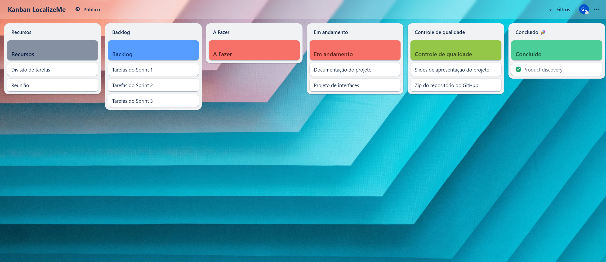

# Solução Implementada

Esta seção apresenta todos os detalhes da solução criada no projeto.

## Vídeo do Projeto

## Video de funcionalidades 
https://drive.google.com/file/d/13KUlLa-10ldSqTp97m2twtp5r8zqnxth/view?usp=sharing

## Video Promocional

## Funcionalidades

Registro, explorar, favoritar, notificações, informações, comentários, categorias.

##### Funcionalidade 1 - Registro

Tela de registro de estabelecimentos novos.

* **Estrutura de dados:** 
      "id": 1,
      "nome": "",
      "descricao": "",
      "conteudo": "",
      "destaque": ,
      "imagem_principal": "",
      "Avaliacoes": "",
      "cardapio": "",
      "instagram": "",
      "endereco": "",
      "Maps": "",
      "categorias": [
        
      ],
      "imagens_complementares": [
        {
          "id": 1,
          "src": "",
          "descricao": ""
        },
        {
          "id": 2,
          "src": "",
          "descricao": ""
        },
        {
          "id": 3,
          "src": "",
          "descricao": ""
        }
      ]
* **Instruções de acesso:**
  Na barra de pesquisa do navegador, altere a página na URL para "gerenciar.html". 
* **Tela da funcionalidade**:
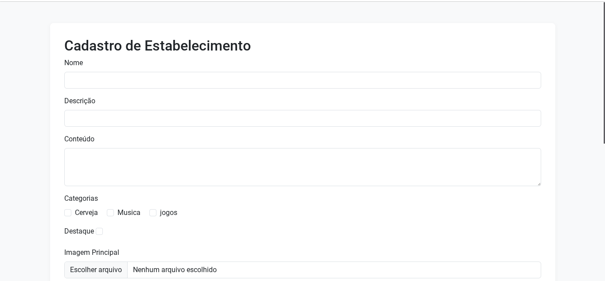

##### Funcionalidade 2 - Explorar

Busque por um estabelecimento específico.

* **Estrutura de dados:** 
      "id": 1,
      "nome": "",
      "descricao": "",
      "conteudo": "",
      "destaque": ,
      "imagem_principal": "",
      "Avaliacoes": "",
      "cardapio": "",
      "instagram": "",
      "endereco": "",
      "Maps": "",
      "categorias": [
        
      ],
      "imagens_complementares": [
        {
          "id": 1,
          "src": "",
          "descricao": ""
        },
        {
          "id": 2,
          "src": "",
          "descricao": ""
        },
        {
          "id": 3,
          "src": "",
          "descricao": ""
        }
      ]
* **Instruções de acesso:**
  Na página inicial, clique em "Buscar destino pelo nome..." e digite o nome do destino.
* **Tela da funcionalidade**:
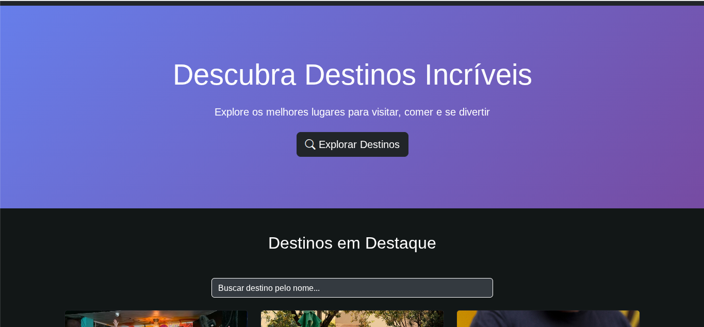

##### Funcionalidade 3 - Favoritar
Guarde os seus estabelecimentos favoritos em uma aba específica.

* **Estrutura de dados:**
    
      "name": "jangal_001",
      "description": "Além dos bons petiscos, drinks e música, o Jângal foi projetado para fazer você relaxar e se divertir, juntando um espaço legal com toques de arte e cultura.",
      "adress": "Rua Outono 523",
      "city": "Belo Horizonte",
      "state": "MG",
      "country": "Brazil"
      "zipcode": "30310124"

* **Instruções de acesso:**
* Veja os bares favoritados e possibilidade de remover dos favoritos.

* **Tela da funcionalidade**:
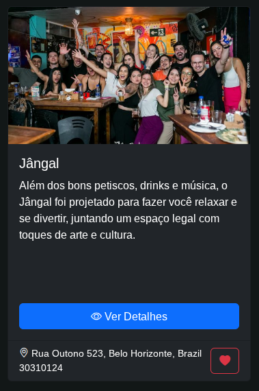

##### Funcionalidade 4 - Notificações

Comente algo sobre o estabelecimento.

* **Estrutura de dados:** 

      "id": "1750364255872-431126336",
      "titulo": "wdadwad",
      "mensagem": "wadawd",
      "tipo": "info",
      "ativa": true,
      "created_at": "2025-06-19T20:17:35.872Z"

* **Instruções de acesso:**

Na tela de admin, é possível criar, alterar e deletar notificações
  
* **Tela da funcionalidade**:
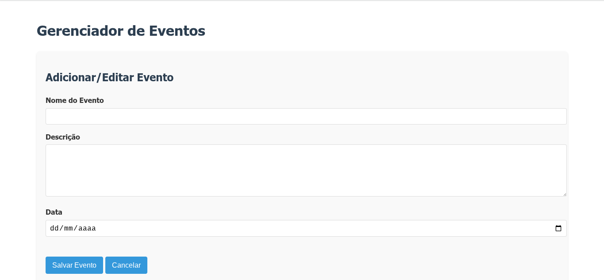

##### Funcionalidade 5 - Informações

Informações sobre o estabelecimento.

* **Estrutura de dados:** 

      "id": 1,
      "nome": "",
      "descricao": "",
      "conteudo": "",
      "destaque": ,
      "imagem_principal": "",
      "Avaliacoes": "",
      "cardapio": "",
      "instagram": "",
      "endereco": "",
      "Maps": "",
      "categorias": [
        
      ],
      "imagens_complementares": [
        {
          "id": 1,
          "src": "",
          "descricao": ""
        },
        {
          "id": 2,
          "src": "",
          "descricao": ""
        },
        {
          "id": 3,
          "src": "",
          "descricao": ""
        }
      ]

* **Instruções de acesso:**

Na página home, aperte em "Ver detlahes" de algum card, ou pesquise no explorar.
  
* **Tela da funcionalidade**:
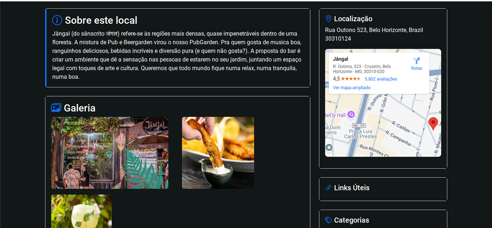

##### Funcionalidade 6 - Comentários

Comente algo sobre o estabelecimento.

* **Estrutura de dados:** 

    "id": "1750621851046",
    "postId": "",
    "nome": "",
    "texto": "",
    "data": "",
    "editado": 

* **Instruções de acesso:**

##### Funcionalidade 7 - Categorias

Página que lista os estabelecimentos filtrados pela categoria selecionada.

* **Estrutura de dados:**
  
[
    {
        "id": "",
        "nome": "  ",
        "bairro": " ",
        "nota": ,
        "imagem": " ",
        "categoria": " "
    },

* **Instruções de acesso:**
  
  Possivel escolher uma catelogia de estabelecimento.
  
* **Tela da funcionalidade**:

> **Orientações:**
>
> * [JSON Introduction](https://www.w3schools.com/js/js_json_intro.asp)
> * [Trabalhando com JSON - Aprendendo desenvolvimento web | MDN](https://developer.mozilla.org/pt-BR/docs/Learn/JavaScript/Objects/JSON)

## Módulos e APIs

Esta seção apresenta os módulos e APIs utilizados na solução

**Images**:

* Unsplash - [https://unsplash.com/](https://unsplash.com/) 

**Fonts:**

* Icons Font Face - [https://fontawesome.com/](https://fontawesome.com/) 

**Scripts:**

* jQuery - [http://www.jquery.com/](http://www.jquery.com/) 
* Bootstrap 4 - [http://getbootstrap.com/](http://getbootstrap.com/) 

# Referências

As referências utilizadas no trabalho foram:

* SEBRAE. Os principais desafios de bares e restaurantes com a retomada do turismo. Sebrae, 2025. Disponível em: https://sebrae.com.br/sites/PortalSebrae/artigos/os-principais-desafios-de-bares-e-restaurantes-com-retomada-do-turismo,ec33102229056810VgnVCM1000001b00320aRCRD. Acesso em: 4 abr. 2025.
* UNIMED. A importância do convívio social para a saúde mental. Unimed, 2025. Disponível em: https://www.unimed.coop.br/site/web/amparo/-/a-importancia-do-convivio-social-para-a-saude-mental#:~:text=O%20conv%C3%ADvio%20social%20tem%20um,essenciais%20para%20nossa%20sa%C3%BAde%20mental. Acesso em: 4 abr. 2025.
* G1. Golpistas aproveitam férias para criar páginas falsas de restaurantes e passeios na internet. Bom Dia Brasil, 18 jul. 2023. Disponível em: https://g1.globo.com/bom-dia-brasil/noticia/2023/07/18/golpistas-aproveitam-ferias-para-criar-paginas-falsas-de-restaurantes-e-passeios-na-internet.ghtml. Acesso em: 4 abr. 2025.
