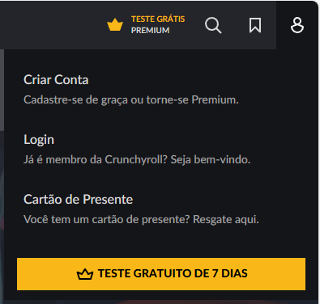
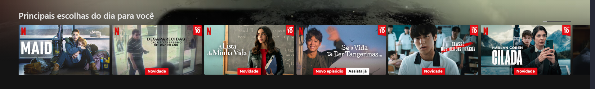
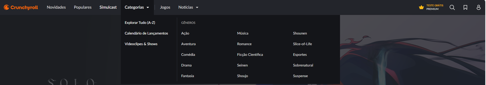
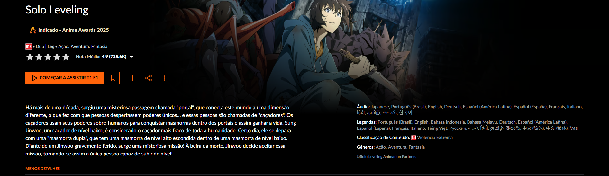

# Introdução

Informações básicas do projeto.

* **Projeto:** LocalizeMe
* **Repositório GitHub:** https://github.com/ICEI-PUC-Minas-CC-TI/ti1-2025-1-t2-manha-localizeme.git
* **Membros da equipe:**

  * Ane Madjarian Viana (https://github.com/anemadjarian)
  * Fernanda Mariana de Oliveira Santos (https://github.com/FeyreJeon)
  * Gabriel Costa Lima (https://github.com/gcl32)
  * Guilherme Almeida Zuim (https://github.com/zoiacode)
  * Mateus Henrique Saturnino Gonçalves (XXXX)
  * Nathan Barros de Carvalho (https://github.com/nthapt)

A documentação do projeto é estruturada da seguinte forma:

1. Introdução
2. Contexto
3. Product Discovery
4. Product Design
5. Metodologia
6. Solução
7. Referências Bibliográficas

✅ [Documentação de Design Thinking (MIRO)](files/processo-dt.pdf)

# Contexto

Detalhes sobre o espaço de problema, os objetivos do projeto, sua justificativa e público-alvo.

## Problema

Belo Horizonte é amplamente reconhecida como a "capital dos bares" no Brasil, oferecendo uma variedade impressionante de estabelecimentos para todos os gostos e preferências. No entanto, essa grande oferta pode tornar a busca pelo bar ideal um desafio, especialmente para quem deseja um local que atenda a critérios específicos.

## Objetivos

O projeto LocalizeMe será um software voltado para oferecer recomendações personalizadas de bares na cidade de Belo Horizonte. Além disso, a plataforma funcionará como um mecanismo de busca, permitindo que os usuários obtenham informações detalhadas sobre cada estabelecimento. O site reunirá dados essenciais, como endereço, cardápio, fotos do local, avaliações e integração com o Instagram para exibição de publicações recentes. Para garantir uma experiência intuitiva, a estrutura do site será projetada de forma clara e acessível, facilitando tanto a administração das páginas pelos proprietários dos estabelecimentos quanto a busca dos clientes pelo bar ideal.

## Justificativa

A motivação para desenvolver o LocalizeMe está diretamente ligada à importância da socialização e da experiência de lazer, tanto para turistas quanto para moradores da cidade. 
Para os turistas, essa dificuldade é ainda maior, pois muitos chegam à cidade sem conhecer bem os bairros, as opções disponíveis e os estilos de bares que mais combinam com suas preferências. 
Já para os moradores da cidade, sair para socializar não é apenas um lazer, mas também uma necessidade para o bem-estar mental. Ter momentos de descontração em um ambiente agradável ajuda a aliviar o estresse, fortalecer vínculos sociais e até melhorar a qualidade de vida. No entanto, muitas pessoas acabam frequentando sempre os mesmos bares por não saberem onde encontrar novas opções alinhadas ao seu gosto.

## Público-Alvo

Existem três perfis para o público-alvo:
1- Donos de estabelecimentos, que administrarão as páginas de seus bares: possuem pouco conhecimento sobre tecnologia, exige um software fácil e prático para entendimento.
2- Pessoas locais.
3-Turistas: pouco ou nenhum conhecimento sobre a cidade de Belo Horizonte.

# Product Discovery

## Etapa de Entendimento

**✳️✳️✳️ APRESENTE OS ARTEFATOS DA ETAPA  ✳️✳️✳️**

> ⚠️ **APAGUE ESSA PARTE ANTES DE ENTREGAR SEU TRABALHO**
>
> Nessa etapa, vamos trabalhar com a metdologia de Design Thinking para compreender com maior profundidade o problema a ser tratado. Nesse processo, vamos elaborar:
>
> * **Matriz CSD**: também conhecida por Matriz de Alinhamento, é uma ferramenta utilizada no Design Thinking para organizar informações e facilitar o processo de tomada de decisão e solução de problemas;
> * **Mapa de stakeholders**: ferramenta que nos permite compreender o grupo de pessoas e entidades que devemos estudar e conversar para entender mais sobre o problema
> * **Entrevistas qualitativas**: série de entrevistas qualitativas para validar suposições e solucionar as dúvidas com as principais pessoas envolvidas;
> * **Highlights de pesquisa**: um compilado do levantamento realizado por meio das entrevistas.

## Etapa de Definição

### Personas

**✳️✳️✳️ APRESENTE OS DIAGRAMAS DE PERSONAS ✳️✳️✳️**

> ⚠️ **APAGUE ESSA PARTE ANTES DE ENTREGAR SEU TRABALHO**
>
> Relacione as personas identificadas no seu projeto e os respectivos mapas de empatia. Lembre-se que você deve ser enumerar e descrever precisamente e de forma personalizada todos os principais envolvidos com a solução almeja.
>
> **Orientações**:
>
> - [Persona x Público-alvo](https://flammo.com.br/blog/persona-e-publico-alvo-qual-a-diferenca/)
> - [O que é persona?](https://resultadosdigitais.com.br/blog/persona-o-que-e/)
> - [Rock Content](https://rockcontent.com/blog/personas/)
> - [Criar personas (Hotmart)](https://blog.hotmart.com/pt-br/como-criar-persona-negocio/)

# Product Design

Nesse momento, vamos transformar os insights e validações obtidos em soluções tangíveis e utilizáveis. Essa fase envolve a definição de uma proposta de valor, detalhando a prioridade de cada ideia e a consequente criação de wireframes, mockups e protótipos de alta fidelidade, que detalham a interface e a experiência do usuário.

## Histórias de Usuários

Com base na análise das personas foram identificadas as seguintes histórias de usuários:

| EU COMO...`PERSONA` | QUERO/PRECISO ...`FUNCIONALIDADE`        | PARA ...`MOTIVO/VALOR`               |
| --------------------- | ------------------------------------------ | -------------------------------------- |
| Usuário do sistema   | Registrar minhas tarefas ⚠️ EXEMPLO ⚠️ | Não esquecer de fazê-las             |
| Administrador         | Alterar permissões ⚠️ EXEMPLO ⚠️      | Permitir que possam administrar contas |

> ⚠️ **APAGUE ESSA PARTE ANTES DE ENTREGAR SEU TRABALHO**
>
> Apresente aqui as histórias de usuário que são relevantes para o projeto de sua solução. As Histórias de Usuário consistem em uma ferramenta poderosa para a compreensão e elicitação dos requisitos funcionais e não funcionais da sua aplicação. Se possível, agrupe as histórias de usuário por contexto, para facilitar consultas recorrentes à essa parte do documento.
>
> **Orientações**:
>
> - [Histórias de usuários com exemplos e template](https://www.atlassian.com/br/agile/project-management/user-stories)
> - [Como escrever boas histórias de usuário (User Stories)](https://medium.com/vertice/como-escrever-boas-users-stories-hist%C3%B3rias-de-usu%C3%A1rios-b29c75043fac)

## Proposta de Valor

**✳️✳️✳️ APRESENTE O DIAGRAMA DA PROPOSTA DE VALOR PARA CADA PERSONA ✳️✳️✳️**

##### Proposta para Persona XPTO ⚠️ EXEMPLO ⚠️


> ⚠️ **APAGUE ESSA PARTE ANTES DE ENTREGAR SEU TRABALHO**
>
> O mapa da proposta de valor é uma ferramenta que nos ajuda a definir qual tipo de produto ou serviço melhor atende às personas definidas anteriormente.

## Requisitos

As tabelas que se seguem apresentam os requisitos funcionais e não funcionais que detalham o escopo do projeto.

### Requisitos Funcionais

| ID     | Descrição do Requisito                                   | Prioridade |
| ------ | ---------------------------------------------------------- | ---------- |
| RF-001 | Permitir que o usuário cadastre tarefas ⚠️ EXEMPLO ⚠️ | ALTA       |
| RF-002 | Emitir um relatório de tarefas no mês ⚠️ EXEMPLO ⚠️ | MÉDIA     |

### Requisitos não Funcionais

| ID      | Descrição do Requisito                                                              | Prioridade |
| ------- | ------------------------------------------------------------------------------------- | ---------- |
| RNF-001 | O sistema deve ser responsivo para rodar em um dispositivos móvel ⚠️ EXEMPLO ⚠️ | MÉDIA     |
| RNF-002 | Deve processar requisições do usuário em no máximo 3s ⚠️ EXEMPLO ⚠️          | BAIXA      |

> ⚠️ **APAGUE ESSA PARTE ANTES DE ENTREGAR SEU TRABALHO**
>
> Os requisitos de um projeto são classificados em dois grupos:
>
> - [Requisitos Funcionais (RF)](https://pt.wikipedia.org/wiki/Requisito_funcional):
>   correspondem a uma funcionalidade que deve estar presente na plataforma (ex: cadastro de usuário).
> - [Requisitos Não Funcionais (RNF)](https://pt.wikipedia.org/wiki/Requisito_n%C3%A3o_funcional):
>   correspondem a uma característica técnica, seja de usabilidade, desempenho, confiabilidade, segurança ou outro (ex: suporte a dispositivos iOS e Android).
>
> Lembre-se que cada requisito deve corresponder à uma e somente uma característica alvo da sua solução. Além disso, certifique-se de que todos os aspectos capturados nas Histórias de Usuário foram cobertos.
>
> **Orientações**:
>
> - [O que são Requisitos Funcionais e Requisitos Não Funcionais?](https://codificar.com.br/requisitos-funcionais-nao-funcionais/)
> - [O que são requisitos funcionais e requisitos não funcionais?](https://analisederequisitos.com.br/requisitos-funcionais-e-requisitos-nao-funcionais-o-que-sao/)

## Projeto de Interface

Artefatos relacionados com a interface e a interacão do usuário na proposta de solução.

### Wireframes

Estes são os protótipos de telas do sistema.

**✳️✳️✳️ COLOQUE AQUI OS PROTÓTIPOS DE TELAS COM TÍTULO E DESCRIÇÃO ✳️✳️✳️**

##### TELA XPTO ⚠️ EXEMPLO ⚠️

Descrição para a tela XPTO


> ⚠️ **APAGUE ESSA PARTE ANTES DE ENTREGAR SEU TRABALHO**
>
> Wireframes são protótipos das telas da aplicação usados em design de interface para sugerir a estrutura de um site web e seu relacionamentos entre suas páginas. Um wireframe web é uma ilustração semelhante ao layout de elementos fundamentais na interface.
>
> **Orientações**:
>
> - [Ferramentas de Wireframes](https://rockcontent.com/blog/wireframes/)
> - [Figma](https://www.figma.com/)
> - [Adobe XD](https://www.adobe.com/br/products/xd.html#scroll)
> - [MarvelApp](https://marvelapp.com/developers/documentation/tutorials/)

### User Flow

**✳️✳️✳️ COLOQUE AQUI O DIAGRAMA DE FLUXO DE TELAS ✳️✳️✳️**


> ⚠️ **APAGUE ESSA PARTE ANTES DE ENTREGAR SEU TRABALHO**
>
> Fluxo de usuário (User Flow) é uma técnica que permite ao desenvolvedor mapear todo fluxo de telas do site ou app. Essa técnica funciona para alinhar os caminhos e as possíveis ações que o usuário pode fazer junto com os membros de sua equipe.
>
> **Orientações**:
>
> - [User Flow: O Quê É e Como Fazer?](https://medium.com/7bits/fluxo-de-usu%C3%A1rio-user-flow-o-que-%C3%A9-como-fazer-79d965872534)
> - [User Flow vs Site Maps](http://designr.com.br/sitemap-e-user-flow-quais-as-diferencas-e-quando-usar-cada-um/)
> - [Top 25 User Flow Tools &amp; Templates for Smooth](https://www.mockplus.com/blog/post/user-flow-tools)

### Protótipo Interativo

**✳️✳️✳️ COLOQUE AQUI UM IFRAME COM SEU PROTÓTIPO INTERATIVO ✳️✳️✳️**

✅ [Protótipo Interativo (MarvelApp)](https://marvelapp.com/prototype/4hd6091?emb=1&iosapp=false&frameless=false)  ⚠️ EXEMPLO ⚠️

> ⚠️ **APAGUE ESSA PARTE ANTES DE ENTREGAR SEU TRABALHO**
>
> Um protótipo interativo apresenta o projeto de interfaces e permite ao usuário navegar pelas funcionalidades como se estivesse lidando com o software pronto. Utilize as mesmas ferramentas de construção de wireframes para montagem do seu protótipo interativo. Inclua o link para o protótipo interativo do projeto.

# Metodologia

Detalhes sobre a organização do grupo e o ferramental empregado.

## Ferramentas

Relação de ferramentas empregadas pelo grupo durante o projeto.

| Ambiente                    | Plataforma | Link de acesso                                     |
| --------------------------- | ---------- | -------------------------------------------------- |
| Processo de Design Thinking | Miro       | https://miro.com/app/board/uXjVIVEqQjM=/           |
| Repositório de código       | GitHub     | https://github.com/ICEI-PUC-Minas-CC-TI/ti1-2025-1-t2-manha-localizeme     |
| Comunicação                 | WhatsApp   | -------------------------------------------------- |
| Slides de apresentação      | Canva      | https://www.canva.com/design/DAGjVXS_89E/y6HKoV64FoL0SPhNwxDk7Q/edit       |
| Reuniões                    | Discord    | -------------------------------------------------- |
| Criação de wireframe        | Figma      | https://www.figma.com/design/3WndzITf1qMX9vyyRNxPGJ/Untitled               |
| Kanban                      | Trello     | https://trello.com/b/yILpng7m/kanban-localizeme    |

## Gerenciamento do Projeto

Divisão de papéis no grupo e apresentação da estrutura da ferramenta de controle de tarefas (Kanban).

| Papel                                      | Membro                                   |
| ------------------------------------------ | ---------------------------------------- |
| Gestão do CSS                              | Ane Madjarian Viana                      |
| Incorporação com o Instagram               | Fernanda Mariana de Oliveira Santos      |
| Gestão do HTML                             | Gabriel Costa Lima                       |
| Gestão do JS                               | Guilherme Almeida Zuim                   |
| Implementação de responsividade e animação | Mateus Henrique Saturnino Gonçalves      |
| Implementação de mapas                     | Nathan Barros de Carvalho                |


# Solução Implementada

Esta seção apresenta todos os detalhes da solução criada no projeto.

## Vídeo do Projeto

O vídeo a seguir traz uma apresentação do problema que a equipe está tratando e a proposta de solução. ⚠️ EXEMPLO ⚠️

[](https://www.youtube.com/embed/70gGoFyGeqQ)

> ⚠️ **APAGUE ESSA PARTE ANTES DE ENTREGAR SEU TRABALHO**
>
> O video de apresentação é voltado para que o público externo possa conhecer a solução. O formato é livre, sendo importante que seja apresentado o problema e a solução numa linguagem descomplicada e direta.
>
> Inclua um link para o vídeo do projeto.

## Funcionalidades

Registro/Login, recomendação de preferências, busca com filtro, informações relevantes sobre o estabelecimento

##### Funcionalidade 1 - Registro

Haverá uma tela de registro para cada usuário.

* **Estrutura de dados:** [Login](#ti_ed_registro)
* **Instruções de acesso:**
  * Abra o site e efetue o login
* **Tela da funcionalidade**:


##### Funcionalidade 2 - Recomendação de preferências

Haverão recomendações personalizadas de acordo com as preferências de cada usuário

* **Estrutura de dados:** [Recomendações](#ti_ed_recomendacoes)
* **Instruções de acesso:**
  * Registre suas preferências e receba recomendações personalizadas
* **Tela da funcionalidade**:


##### Funcionalidade 1 - Busca

Haverá uma divisão por categorias e busca por nome ou tema do local

* **Estrutura de dados:** [Busca](#ti_ed_busca)
* **Instruções de acesso:**
  * Abra o site e busque um local
* **Tela da funcionalidade**:


##### Funcionalidade 1 - Informações

Haverá uma tela com informações relevantes para cada estabelecimento

* **Estrutura de dados:** [Login](#ti_ed_informacoes)
* **Instruções de acesso:**
  * Abra o site, abra um local desejado e tenha acesso a todas as informacoes relevantes a respeito.
* **Tela da funcionalidade**:


## Estruturas de Dados

Exemplo de um perfil criado com todos os dados informados, incluindo as categorias de interesse da pessoa.

##### Estrutura de Dados - Perfis

Contatos da aplicação

```json
  {
    "id": 1,
    "nome": "Leanne Graham",
    "email": "Sincere@april.biz",
    "idade": "25",
    "telefone": "1-770-736-8031",
    "cidade": "Belo Horizonte",
    "categorias": "tematico",
  }
```

##### Estrutura de Dados - Usuários

Registro dos usuários do sistema utilizados para login e para o perfil do sistema

```json
  {
    id: "eed55b91-45be-4f2c-81bc-7686135503f9",
    email: "joana@abc.com",
    id: "eed55b91-45be-4f2c-81bc-7686135503f9",
    login: "user",
    nome: "Usuário do Sistema",
    senha: "123"
  }
```

> **Orientações:**
>
> * [JSON Introduction](https://www.w3schools.com/js/js_json_intro.asp)
> * [Trabalhando com JSON - Aprendendo desenvolvimento web | MDN](https://developer.mozilla.org/pt-BR/docs/Learn/JavaScript/Objects/JSON)

## Módulos e APIs

Esta seção apresenta os módulos e APIs utilizados na solução

**Images**:

* Unsplash - [https://unsplash.com/](https://unsplash.com/) 

**Fonts:**

* Icons Font Face - [https://fontawesome.com/](https://fontawesome.com/) 

**Scripts:**

* jQuery - [http://www.jquery.com/](http://www.jquery.com/) 
* Bootstrap 4 - [http://getbootstrap.com/](http://getbootstrap.com/) 

# Referências

As referências utilizadas no trabalho foram:

* SOBRENOME, Nome do autor. Título da obra. 8. ed. Cidade: Editora, 2000. 287 p ⚠️ EXEMPLO ⚠️

> ⚠️ **APAGUE ESSA PARTE ANTES DE ENTREGAR SEU TRABALHO**
>
> Inclua todas as referências (livros, artigos, sites, etc) utilizados no desenvolvimento do trabalho.
>
> **Orientações**:
>
> - [Formato ABNT](https://www.normastecnicas.com/abnt/trabalhos-academicos/referencias/)
> - [Referências Bibliográficas da ABNT](https://comunidade.rockcontent.com/referencia-bibliografica-abnt/)
